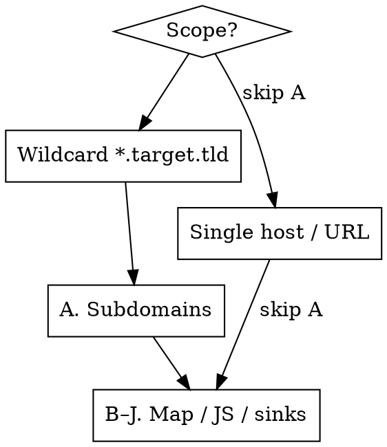

# Recon — Map, JS, Secrets, Sinks & Subdomains

Map the attack surface headless, then hand concrete endpoints/hosts/secrets/sinks to the vuln
skills. Recon's job is **discovery**, not exploitation. Stay passive-first; never actively fuzz
an out-of-scope host. Everything is **headless** — `curl` for fetches, a headless browser
(Playwright) for rendering SPAs, no GUI. **Save every fetched JS file** — saved files are
the system of record.

**Tools, kept minimal:** `gau` (passive JS-URL harvest), `xnLinkFinder` (endpoint/param
extraction), `ugrep` (fast drop-in grep for paths/secrets/sinks), plus `curl`+`jq` and a
headless browser. Subdomains come from `/profundis`; active content/param fuzzing from
`/ffuf-skill`. Nothing else.

This skill runs, in order: **(A) subdomains** (wildcard only) → **(B) map the app + fingerprint
frameworks** → **(C) discover all JS** → **(D) enumerate webpack chunks** → **(E) source maps** →
**(F) extract endpoints** → **(G) secrets** → **(H) postMessage handlers** → **(I) DOM sinks** →
**(J) hidden params**. Steps H–J feed `/xss`.

---

## Scope gate — decide what to run



- **Wildcard `*.target.tld`** → run A first, then B–J on each live host.
- **One specific host/URL** → **skip A** (no subdomain enum — out of scope), go straight to B–J on
  that host and the APIs it calls.
- B–J (mapping + JS mining) **always** apply. This is where the real bugs hide.

---

## A. Subdomain discovery — wildcard scope only

**Use `/profundis`. Do not run subdomain-enumeration tools** (no subfinder, amass, httpx, etc.).

**REQUIRED SUB-SKILL:** invoke **profundis** for passive discovery (CT/certstream, host & DNS
search). Prefer its `hosts`/`dns` queries (1 credit/page, `raw_query` filtering) and **always
estimate-first** before `subdomains` enumeration so you don't drain the wallet. Pivot on CNAMEs
(`dns` search, `type:CNAME`) for subdomain-takeover candidates — but only report a takeover with
the dangling DNS record *actually present* (see CLAUDE.md always-ignore).

Take the in-scope hosts `/profundis` returns, add them to your scope/target list, run B–J per host.

---

## B. Map the application — fingerprint known frameworks

Before pulling JS, learn what you're looking at. Fingerprint the front-end framework, then walk
the app headless so JS-rendered routes and the XHR/fetch calls they make land in your traffic.

```bash
# Quick fingerprint: pull the landing HTML + main bundle, ugrep known framework markers
curl -sk "https://app.target.tld/" -o index.html
ugrep -aoErhE \
  'webpackChunk\w*|__webpack_require__|__NEXT_DATA__|/_next/|/_nuxt/|__NUXT__|data-reactroot|__REACT_DEVTOOLS_GLOBAL_HOOK__|ng-version|platformBrowser|__VUE__|data-v-[0-9a-f]{8}|/@vite/client|sveltekit' \
  index.html | sort -u
```

| Marker | Framework | What it tells you |
|---|---|---|
| `__NEXT_DATA__`, `/_next/static/` | **Next.js** | SSR props blob in HTML (often leaks IDs/data); API routes under `/api/*`; chunks in `/_next/static/chunks/` |
| `__NUXT__`, `/_nuxt/` | **Nuxt/Vue** | hydrated state blob; chunks in `/_nuxt/` |
| `data-reactroot`, `react-dom` | **React** (CRA) | webpack chunks; SPA routes are client-side |
| `ng-version`, `platformBrowser` | **Angular** | lazy-loaded modules as separate chunks; `main.js` runtime |
| `data-v-XXXXXXXX`, `__VUE__` | **Vue** | scoped-component SPA |
| `/@vite/client`, `modulepreload` | **Vite** | ES-module chunks (not classic webpack) |
| `webpackChunk*`, `__webpack_require__` | **webpack** runtime | chunk manifest is enumerable → see step **D** |

**Headless walk (DOM Hunter — see CLAUDE.md Mode 3):** drive the headless browser through every
role-gated/lazy route. Every JS file and every XHR/fetch endpoint it loads is captured — that
inventory feeds C and F. Dump `localStorage`/`sessionStorage` for tokens, UUIDs, role strings.

---

## C. Discover all JS files — pull every bundle

Harvest JS URLs passively with `gau`, merge the ones the headless walk loaded, then fetch & keep.

```bash
# Passive URL harvest (Wayback / CommonCrawl / OTX), keep only JS
gau --subs target.tld | ugrep -Ei '\.js(\?|$)' | sort -u > js_urls.txt
# (append any JS URLs the headless walk loaded that gau missed, then dedupe)
sort -u js_urls.txt -o js_urls.txt

# Fetch them all, save raw — the saved files are ground truth
mkdir -p js && while read -r u; do
  f="js/$(echo "$u" | sed 's#[^a-zA-Z0-9]#_#g').js"
  curl -sk "$u" -o "$f"
done < js_urls.txt
```

---

## D. Enumerate webpack chunks — the lazy-loaded JS `gau` never saw

A webpack runtime carries a **chunk map** (`chunkId → contenthash`) and a filename template. Most
of the app's code is in lazy chunks that are never linked anywhere `gau` can find them — you
reconstruct their URLs from the manifest in the main/runtime bundle.

```bash
# 1. Confirm webpack + locate the runtime/main bundle
ugrep -alE 'webpackChunk\w*|__webpack_require__\.u\s*=' js/

# 2. Pull the chunkId:"hash" pairs from the manifest object
ugrep -aoErhE '[0-9]+:"[0-9a-f]{6,}"' js/ | sort -u > chunk_map.txt

# 3. Read the filename template from the runtime (the .u / .miniCssF function):
#    e.g.  "static/js/" + e + "." + {…}[e] + ".chunk.js"   →  base path + ".chunk.js"
ugrep -aoErhE '"(static/js/|/_next/static/chunks/|chunks/|js/)"' js/ | sort -u

# 4. Reconstruct + fetch each chunk:  <base>/<id>.<hash>.chunk.js
while IFS=':' read -r id hash; do
  hash="${hash%\"}"; hash="${hash#\"}"
  u="https://app.target.tld/static/js/${id}.${hash}.chunk.js"   # adjust template from step 3
  curl -sk "$u" -o "js/chunk_${id}.js"
done < chunk_map.txt
```

The path template varies by framework (CRA `static/js/`, Next `/_next/static/chunks/`). Read it
from step 3, don't guess. Newly fetched chunks go through E–J like any other bundle.

---

## E. Check for source maps — original source is gold

For any `bundle.js`, try `bundle.js.map` (or read the `//# sourceMappingURL=` trailer). A `.map`
reconstructs original, un-minified source incl. comments, folder structure, and internal names.

```bash
ugrep -aoErh 'sourceMappingURL=[^ *]+' js/ | sort -u           # declared map URLs
curl -sk "https://app.target.tld/static/js/main.js.map" -o main.js.map
jq -r '.sources[]' main.js.map        # original file tree → reveals internal module names
jq -r '.sourcesContent[]' main.js.map > src_dump.js   # full original source → re-run E–I (ugrep) on it
```

---

## F. Extract endpoints & params

Pull every route, API path, and parameter out of the saved JS. These drive request testing.

```bash
# Reliable baseline: regex-extract relative paths + absolute URLs (ugrep — fast over big js/)
ugrep -aErhoE '"(/[a-zA-Z0-9_./-]+)"' js/ | tr -d '"' | sort -u > paths.txt
ugrep -aErhoE '(https?:)?//[a-zA-Z0-9._-]+/[a-zA-Z0-9_./-]*' js/ | sort -u >> paths.txt

# Richer: xnLinkFinder also pulls params. NOTE: -sf filters by link *domain*, which
# drops relative paths (most of a JS bundle). Add -sp (scope-prefix) + -spo so relative
# /api/... links are prefixed with the scope domain and kept; -op writes a params-only list.
xnLinkFinder -i js/ -sp target.tld -spo -sf target.tld -o endpoints.txt -op params.txt
```

What to look for:
- **Hidden/admin/internal routes** — `/api/internal/*`, `/api/admin/*`, `/debug`, `/actuator`.
- **Version pivots** — app calls `/api/v3/*` → manually try `/api/v1/*`, `/api/v2/*` (older
  versions often skip newer authz checks).
- **GraphQL** — a `/graphql` ref → try introspection (`{"query":"{__schema{types{name}}}"}`).
- **Swagger/OpenAPI** — pull `/swagger`, `/openapi.json`, `/v3/api-docs` if referenced.
- **Feature flags, role/permission strings, cloud bucket names, third-party integrations.**
- **Param names** (`params.txt`) — feed step **J** for reflected-XSS testing.

Feed discovered paths to the vuln skills (`/idor`, `/ssrf`, `/sql`, …) for actual testing.

**Active discovery — `/ffuf-skill`.** The passive map (`gau` + JS) only sees *referenced* paths;
unlinked directories, files, backups and hidden params won't show up. To brute-force them on
in-scope hosts, **invoke `/ffuf-skill`** (directory/file/param fuzzing, auto-calibration,
authenticated raw-request fuzzing). Seed it with `params.txt` and the route prefixes found above.
Respect rate limits and back off on WAF/`403` patterns (see CLAUDE.md).

---

## G. Hunt for secrets in JS

Hardcoded API keys, cloud tokens, JWTs and private keys in bundles are **always worth reporting**
(per CLAUDE.md) and frequently chain to critical (key → backend API → mass data).

One engine: the curated regex catch-all shipped with this skill, run with `ugrep`. It covers
typed keys (AWS/GCP/Stripe/JWT/private-key headers) **and** what typed scanners miss — internal
S3/GCS bucket names, custom token formats, generic `secret=`/`token=` assignments.

```bash
# Curated regex catch-all shipped with this skill (-i: catches apiKey/APIKEY too).
ugrep -aErni -f .claude/skills/recon/secret-patterns.txt js/ > grep_hits.txt
# (in a workspace the skill is symlinked at .claude/skills/recon/; adjust the path if run elsewhere)
```

Every hit is a **lead, not a finding** — there's no live verification here. Confirm each one
manually before treating it as real.

**Triage — a hit is a lead, not a finding:**
- **Confirm it's live & in-scope** before using it. Don't burn a key on noise.
- **Map the key to its service** — what API does it unlock? what data?
- **Chain to impact:** API key → authenticated backend call → mass read → critical.
  Cloud token → S3/GCS/blob → PII or internal files → critical.
- **One validated secret = stop, document, report.** Do not enumerate or exfiltrate at scale
  (mirrors `/credential-leaks` discipline). Capture the minimal proof and halt.

---

## H. Check postMessage handlers

Origin-less `message` listeners are a classic cross-origin DOM-XSS / data-theft primitive, and
sender-side `postMessage(data, '*')` is a quiet data leak. Step I's `dom-sinks.txt` nets
`.postMessage(` and basic listeners incidentally; **this is the dedicated pass** — receivers,
sender leaks, and origin-check triage.

The flat grep that used to live here had a hole: the only hit that actually matters — a listener
with **no** origin check that **also** feeds a sink — is invisible to it on minified single-line
bundles, where line context (`-A`/`-B`) dumps the whole file. So this step does three things.

> **Resource note:** `ugrep` is auto-capped by the wrapper (`~/.local/bin/ugrep`: 2G RAM, 1 core,
> first-OOM-victim) so a search can't OOM-kill tmux on this 2-core/no-swap box. For very large `js/`
> trees, serialize with `ugrep -j 1` and bound any `.{0,N}` snippet output with `| head -c 8M`.

### 1. Hit list — every receiver & sender (curated list)

```bash
ugrep -anE -f .claude/skills/recon/postmessage-handlers.txt js/ > postmessage_hits.txt
# (symlinked at .claude/skills/recon/ in a workspace; adjust the path if run elsewhere)
# covers: window/message listeners, MessageChannel/MessagePort/BroadcastChannel/SharedWorker
# receivers, all .postMessage senders, and origin/source validation markers (section C).
```

### 2. Sender-side wildcard leak — a lead on its own

`.postMessage(data, '*')` (or `{targetOrigin:'*'}`) delivers the payload to **every** origin
holding the window/worker/port ref. If the payload carries tokens / PII / internal data → leak.

```bash
ugrep -aonE "\.postMessage\s*\([^)]*,\s*[\"'\`]\*[\"'\`]|targetOrigin\s*:\s*[\"'\`]\*" js/
```

### 3. Handler-body snippet + origin-check triage — the shortlist for /xss

Grab N chars around each listener (works on one-line minified bundles where `-A`/`-B` are useless),
then keep only snippets that touch a sink **and** lack an origin/source guard:

```bash
# each message listener + ~400 chars of its body, capped to 8 MB so a match-explosion
# on a minified single-line bundle can't run away (head closes the pipe -> ugrep stops)
ugrep -aohE ".{0,60}(addEventListener\(\s*[\"'\`]message|\bonmessage).{0,400}" js/ \
  | head -c 8388608 \
  | ugrep -E '\.data|innerHTML|outerHTML|insertAdjacentHTML|document\.write|eval|new\s+Function|location\s*=|\.href|srcdoc|setTimeout|setAttribute' \
  | ugrep -vE '\.(origin|source)|isTrusted' > postmessage_suspects.txt
```

For each survivor, confirm a crafted `postMessage` from a controlled origin reaches the sink in
the headless browser, then hand the page + payload to **`/xss`**. A listener that reads data into
**no** sink is a (weaker) data-leak note, not an XSS. The filter is a heuristic (it can't see
across nested-paren data or a guard defined outside the 400-char window) — treat its output as a
priority queue, not a verdict.

---

## I. Identify DOM sinks → hand to /xss

Find the dangerous sinks and the user-controlled sources that might reach them.

```bash
# Curated sink + source list shipped with this skill (innerHTML, eval, document.write,
# location=, jQuery .html(), v-html, plus the source-side markers location.hash/search, etc.)
ugrep -aErni -f .claude/skills/recon/dom-sinks.txt js/ > dom_hits.txt
```

A hit is a **sink, not a bug**. It's exploitable only if a user-controlled **source**
(`location.hash`/`search`, `document.referrer`, `window.name`, a URL param, postMessage `e.data`)
reaches it unsanitised.

**→ If any sink shows a plausible source→sink flow, invoke `/xss`.** That skill owns the
source-to-sink trace in the headless browser debugger and the execution PoC. Recon's job ends at
"here's the sink, here's the candidate source, here's the page" — don't try to confirm execution
here.

---

## J. Hidden parameters → test reflected XSS via the URL

`xnLinkFinder` (`params.txt`) and the JS often reveal parameter names the UI never exposes
(`?debug=`, `?redirect=`, `?html=`, `?callback=`, `?next=`, `?template=`). A param read by the
page but absent from the visible form is a prime reflected/DOM-XSS candidate.

For each hidden param, **append it to the URL with a probe and check for reflection/execution**:

```bash
# Reflection probe (unique marker) — does the value come back unencoded in the response/DOM?
curl -sk "https://app.target.tld/page?<hiddenparam>=xss7331probe" | ugrep -o 'xss7331probe'
```

If the marker reflects (HTML context, attribute, or a JS sink from step I picks it up) → **invoke
`/xss`** to escalate the probe to a real payload and confirm execution headless. Hidden params
that feed `location`/redirect sinks are also open-redirect → OAuth-ATO candidates.

---

## Handoff — recon → exploitation → report

| Recon output | Next |
|---|---|
| New live host (wildcard) | add to scope → B–J on it |
| Endpoint / hidden route / param | `/idor`, `/rbac`, `/ssrf`, `/sql`, `/ssti`, `/xxe` |
| **DOM sink with source flow** | **`/xss`** |
| **Origin-less postMessage handler → sink** | **`/xss`** |
| **Hidden param that reflects** | **`/xss`** (or open-redirect → OAuth chain) |
| Hardcoded API key / cloud token | validate in-scope → chain → `/report-yeswehack` |
| Leaked credential (OathNet) | `/credential-leaks` validation flow → `/report-yeswehack` |
| Subdomain takeover candidate (dangling CNAME) | confirm record present → `/report-yeswehack` |

A leaked secret or a valid leaked credential is **itself reportable** even before you chain it.

---

## Guardrails

- **Headless, passive-first.** `gau` reads archives; the only live HTTP is `curl`/headless-browser
  fetches against **in-scope hosts**. Never fetch/fuzz out-of-scope hosts.
- **Never actively fuzz out-of-scope hosts.** Inspecting an adjacent asset to prove a chain back
  to in-scope impact is fine; launching injection/fuzzing at it is not (see CLAUDE.md).
- **Profundis wallet:** estimate-first on `subdomains`; prefer 1-credit `hosts`/`dns` queries.
- **Rate limits:** stay under ~10 req/s when `curl`-fetching the JS/chunk list; don't parallelize hard.
- **Don't enumerate or exfiltrate at scale.** Proof, then stop.

---

## Quick reference — full pass

```bash
# A. (wildcard only) subdomains → invoke /profundis (no local tools). Add returned hosts to scope.

# B. map + fingerprint frameworks
curl -sk "https://app.target.tld/" -o index.html
ugrep -aoErhE 'webpackChunk\w*|__NEXT_DATA__|/_next/|/_nuxt/|__NUXT__|data-reactroot|ng-version|__VUE__|/@vite/client' index.html | sort -u
#    + headless walk (Playwright, CLAUDE.md Mode 3) to capture JS-rendered routes & XHR endpoints

# C. discover all JS — gau + headless-captured URLs
gau --subs target.tld | ugrep -Ei '\.js(\?|$)' | sort -u > js_urls.txt
mkdir -p js && while read -r u; do curl -sk "$u" -o "js/$(echo "$u"|sed 's#[^a-zA-Z0-9]#_#g').js"; done < js_urls.txt

# D. webpack chunks — reconstruct lazy chunks from the manifest
ugrep -aoErhE '[0-9]+:"[0-9a-f]{6,}"' js/ | sort -u > chunk_map.txt   # then build <base>/<id>.<hash>.chunk.js and curl

# E. source maps
ugrep -aoErh 'sourceMappingURL=[^ *]+' js/ | sort -u
jq -r '.sourcesContent[]' main.js.map > src_dump.js 2>/dev/null

# F. endpoints + params
ugrep -aErhoE '"(/[a-zA-Z0-9_./-]+)"' js/ | tr -d '"' | sort -u > paths.txt
xnLinkFinder -i js/ -sp target.tld -spo -sf target.tld -o endpoints.txt -op params.txt

# G. secrets
ugrep -aErni -f .claude/skills/recon/secret-patterns.txt js/ > grep_hits.txt

# H. postMessage handlers + sender wildcard leaks + origin-check triage  → if sink reached, /xss
ugrep -anE -f .claude/skills/recon/postmessage-handlers.txt js/
ugrep -aonE "\.postMessage\s*\([^)]*,\s*[\"'\`]\*[\"'\`]|targetOrigin\s*:\s*[\"'\`]\*" js/
ugrep -aohE ".{0,60}(addEventListener\(\s*[\"'\`]message|\bonmessage).{0,400}" js/ \
  | head -c 8388608 \
  | ugrep -E '\.data|innerHTML|eval|location\s*=|document\.write|srcdoc|setTimeout' | ugrep -vE '\.(origin|source)|isTrusted'

# I. DOM sinks  → if source→sink flow, invoke /xss
ugrep -aErni -f .claude/skills/recon/dom-sinks.txt js/ > dom_hits.txt

# J. hidden params → reflected-XSS probe  → if it reflects, invoke /xss
curl -sk "https://app.target.tld/page?<hiddenparam>=xss7331probe" | ugrep -o 'xss7331probe'

# → hand hosts/endpoints/secrets to the vuln skills; sinks/postMessage/hidden-params → /xss
```
