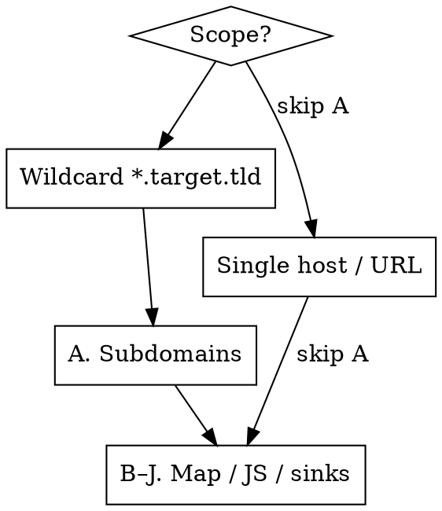

# Recon — Map, JS, Secrets, Sinks & Subdomains

Map the attack surface headless, then hand concrete endpoints/hosts/secrets/sinks to the vuln
skills. Recon's job is **discovery**, not exploitation. Stay passive-first; never actively fuzz
an out-of-scope host. Everything is **headless** — `curl` for fetches, a headless browser
(Lightpanda by default, Chrome fallback) for rendering SPAs, no GUI. **Save every fetched JS file** — saved files are
the system of record.

**Tools, kept minimal:** `gau` (passive JS-URL harvest), `xnLinkFinder` (endpoint/param
extraction), `ugrep` (fast drop-in grep for paths/secrets/sinks), plus `curl`+`jq` and a
headless browser. Subdomains come from `/profundis`; **active content/param fuzzing from
`/ffuf-skill` — always invoked in recon (step F), WAF or not**. Nothing else.

This skill runs, in order: **(A) subdomains** (wildcard only) → **(B) map & probe the host surface**
(fingerprint frameworks → **B.1** WAF → **B.2** force errors → **B.3–B.4** unauth exposure →
`/exposure` → **B.5** 401/403 → `/403-401`) → **(C) discover all JS** → **(D) enumerate webpack
chunks** → **(E) source maps** → **(F) extract endpoints** → **(G) secrets** →
**(H) postMessage handlers** → **(I) DOM sinks** → **(J) hidden params**, then the
**recon completion checklist** gates the move to exploitation. Steps H–J feed `/xss`.

---

## Scope gate — decide what to run



- **Wildcard `*.target.tld`** → run A first, then B–J on each live host.
- **One specific host/URL** → **skip A** (no subdomain enum — out of scope), go straight to B–J on
  that host and the APIs it calls.
- B–J (mapping + JS mining) **always** apply. This is where the real bugs hide.

---

## Working directory layout — one clean folder per host

**Every host gets its own self-contained folder. Never write recon artifacts flat into the workspace root** — on a multi-host (wildcard) scope that silently overwrites one host's `index.html`/`js/`/`ffuf.json` with the next host's. Keep each host isolated so findings stay correlated and nothing collides.

The `hunt.sh` workspace (`<target>/`, already per-target) is the root. Inside it:

```
<target>/                    # workspace (per target) — you start here
├─ scope.txt                 # A's host list + cross-host notes (workspace root)
└─ hosts/
   ├─ app.target.com/        # one folder per host — all of B–J lands here
   │  ├─ index.html  headers.txt
   │  ├─ js/                  # every fetched bundle (C–E)
   │  ├─ endpoints.txt        # F
   │  ├─ secrets.txt          # G  (grep hits)
   │  ├─ ffuf.json            # F/active fuzz
   │  ├─ postmessage_hits.txt # H
   │  ├─ dom_hits.txt         # I
   │  └─ notes.md             # per-host running notes / assumptions
   └─ api.target.com/ …
```

**Before running B–J for a host, create and enter its folder** so every relative path in the steps below is automatically scoped to that host:

```bash
WS="$PWD"                                                 # workspace root — pin it before cd
RES="$WS/.claude/skills/recon"                            # wordlists live here (secret-patterns.txt, dom-sinks.txt, …)
HOST='app.target.com'                                     # bare host, no scheme
host_slug=$(printf '%s' "$HOST" | sed 's#^https\?://##; s#[:/].*##; s#[^A-Za-z0-9._-]#_#g')
mkdir -p "$WS/hosts/$host_slug" && cd "$WS/hosts/$host_slug"   # all B–J artifacts now land here
# … run B–J …
cd "$WS"                                                  # back to workspace root before the next host
```

**Path caveat:** the B–J command snippets below reference wordlists as `.claude/skills/recon/…` (relative to the workspace root). Once you `cd` into a host folder, reference them via **`$RES/…`** instead (e.g. `ugrep -f "$RES/secret-patterns.txt" js/`) — the resources are two levels up, not in the host folder. Everything the host commands *write* (`index.html`, `js/`, `*.txt`, `ffuf.json`) stays relative = inside `hosts/<host>/`.

Report files (`/report-yeswehack`) still go where that skill puts them (workspace root by default); recon artifacts stay under `hosts/<host>/`. **The completion checklist below is per host** — clear it for each host's folder.

---

## A. Subdomain discovery — wildcard scope only

**Use `/profundis`. Do not run subdomain-enumeration tools** (no subfinder, amass, httpx, etc.).

**REQUIRED SUB-SKILL:** invoke **profundis** for passive discovery (CT/certstream, host & DNS
search). Prefer its `hosts`/`dns` queries (1 credit/page, `raw_query` filtering) and **always
estimate-first** before `subdomains` enumeration so you don't drain the wallet. Pivot on CNAMEs
(`dns` search, `type:CNAME`) for subdomain-takeover candidates — but only report a takeover with
the dangling DNS record *actually present* (see CLAUDE.md always-ignore).

Take the in-scope hosts `/profundis` returns, write them to `scope.txt` at the workspace root, then run B–J per host — **each inside its own `hosts/<host>/` folder** (see *Working directory layout* above).

---

## B. Map the application — fingerprint & probe the host surface

Before pulling JS, learn what you're looking at. Fingerprint the front-end framework, then walk
the app headless so JS-rendered routes and the XHR/fetch calls they make land in your traffic.

```bash
# Quick fingerprint: pull the landing HTML + main bundle, ugrep known framework markers
curl -sk "https://app.target.tld/" -o index.html
ugrep -aoErhE \
  'webpackChunk\w*|__webpack_require__|__NEXT_DATA__|/_next/|/_nuxt/|__NUXT__|data-reactroot|__REACT_DEVTOOLS_GLOBAL_HOOK__|ng-version|platformBrowser|__VUE__|data-v-[0-9a-f]{8}|/@vite/client|sveltekit' \
  index.html | sort -u
```

| Marker | Framework | What it tells you |
|---|---|---|
| `__NEXT_DATA__`, `/_next/static/` | **Next.js** | SSR props blob in HTML (often leaks IDs/data); API routes under `/api/*`; chunks in `/_next/static/chunks/` |
| `__NUXT__`, `/_nuxt/` | **Nuxt/Vue** | hydrated state blob; chunks in `/_nuxt/` |
| `data-reactroot`, `react-dom` | **React** (CRA) | webpack chunks; SPA routes are client-side |
| `ng-version`, `platformBrowser` | **Angular** | lazy-loaded modules as separate chunks; `main.js` runtime |
| `data-v-XXXXXXXX`, `__VUE__` | **Vue** | scoped-component SPA |
| `/@vite/client`, `modulepreload` | **Vite** | ES-module chunks (not classic webpack) |
| `webpackChunk*`, `__webpack_require__` | **webpack** runtime | chunk manifest is enumerable → see step **D** |

**Headless walk (DOM Hunter — see CLAUDE.md Mode 3):** drive the headless browser through every
role-gated/lazy route. Every JS file and every XHR/fetch endpoint it loads is captured — that
inventory feeds C and F. Dump `localStorage`/`sessionStorage` for tokens, UUIDs, role strings.

### B.1 — Detect the WAF (passive-first, then one probe)

A WAF in front of the host only changes how you **tune** **F** (`/ffuf-skill`) — it never cancels it.
**Default stance: don't assume a WAF.** Detection here is passive (read responses you already
fetched); you react only if a WAF actually shows up, and even then you keep running F — just adapted
(slower rate, smaller wordlist, obfuscated payloads) — never abort. **Recon detects only**; evasion
*technique* lives in `/waf-bypass`. Do it here, once, right after fingerprinting the framework.

**Passive (read the response you already fetched):** headers, cookies and the error body of the
landing page usually name the WAF with no provocation.
```bash
# headers + cookies from a HEAD (B already saved the body to index.html)
curl -sI "https://app.target.tld/" | ugrep -iE 'cf-ray|cloudflare|x-amzn|x-iinfo|incap_ses|visid_incap|akamaighost|sucuri|x-azure-ref|server:'
# body of the landing page for block-page / vendor strings
ugrep -iE 'cloudflare|incapsula|mod_security|sucuri|generated by cloudfront' index.html
```

| Indicator | Product |
|---|---|
| `cf-ray:`, `Server: cloudflare`, `__cf_bm`/`__cfduid` | Cloudflare |
| `x-amzn-trace-id`/`x-amzn-requestid`, body `Request blocked.` | AWS WAF |
| `X-Azure-Ref`, `Server: Microsoft-Azure-Application-Gateway` | Azure Front Door / App Gateway |
| `Server: AkamaiGHost`, `_abck`/`bm_sz` cookies | Akamai / Kona |
| `X-Iinfo:`, `incap_ses`/`visid_incap`, body `Powered By Incapsula` | Imperva / Incapsula |
| `BigIP`/`F5`, jumbled `X-Cnection:` | F5 BIG-IP ASM |
| body `generated by Mod_Security` | ModSecurity (CRS) |
| `X-Sucuri-ID`, `Server: Sucuri/Cloudproxy` | Sucuri CloudProxy |
| Unusual status `406`/`451`/`493`/`999`/`503` where origin would `200`/`404` | a WAF is intercepting |

**One light active probe** (only if passive was inconclusive) — a single noisy payload; watch for the
block status/page, not for a vuln:
```bash
curl -sk -o /dev/null -w '%{http_code}' "https://app.target.tld/?id='%20OR%201=1--"
# 200 = no WAF (or log-only); 403/406/451 + a block page = WAF present
```

Record one line in your working notes: `WAF: <product> | none`. **A detected WAF never aborts recon or
skips F** — when you reach **F** you still run `/ffuf-skill`, just adapted: lower `-rate`/`-t`, smaller
targeted wordlist, payload obfuscation. Evasion *technique* (infra/origin bypass first, then
product-specific) lives in **`/waf-bypass`** for when an adapted ffuf pass keeps getting blocked.

> Long tail of ~100 rarer products (regional, CMS-plugin, enterprise) → `/waf-bypass` ships
> `waf-fingerprints.md` for the lookup; this compact set covers the ~90% case.

### B.2 — Force errors to fingerprint

Deliberately malformed requests trigger the app's error handler, which usually names the framework,
version, language and server — and sometimes over-reaches (file paths, SQL, env, source). Cheap and
one-shot per host; its real job is to **refine B's fingerprint** so C–J target the right tech.

```bash
BASE="https://app.target.tld"
# malformed path / bad param / unsupported verb / broken JSON — capture status + headers + body
for probe in "/%00" "/__nope_xyz__" "/api/v9/nope" "/?id='" "/?[]=a"; do
  curl -sk -D - -o "err_$(echo "$probe" | tr -c 'a-zA-Z0-9' '_').html" "$BASE$probe" | head -n 20
done
# method + content-type errors
curl -sk -D - "$BASE/"    -X PROPFIND | head -n 20
curl -sk -D - "$BASE/api" -X POST -H 'Content-Type: application/json' -d '{' | head -n 20
```

| Tell in the error body / headers | Framework / stack |
|---|---|
| `Whitelabel Error Page`, JSON `{timestamp,status,error,path}`, `type=…` | **Spring Boot** (Java) |
| `Apache Tomcat`, `/manager/html`, cookie `JSESSIONID` | Tomcat / Java servlet |
| Stack trace with `at …`, `/node_modules/`, `at <anonymous>` | **Node.js / Express** |
| `Traceback (most recent call last)`, `DJANGO_SETTINGS_MODULE`, `DEBUG = True` | **Django** (Python) |
| `Whoops, looks like something went wrong`, `vendor/laravel` | **Laravel** (PHP) |
| `Server Error in '/' Application`, `.NET`, `Stack Trace:` (yellow screen) | **ASP.NET** |
| `SQLSTATE`, `PDOException`, `mysqli_error` | PHP + DB driver |
| `X-Powered-By: PHP/x.y` / `Express`, `Server: nginx/x.y` | language / server (bare version = noise) |

**Triage:** a framework/version name alone is **noise — don't report it** (CLAUDE.md). But an error
that leaks **absolute file paths, SQL/queries, internal hostnames, env-var names, source snippets, or
a `DEBUG=True` page** is reportable information disclosure — capture the response and hand it to
`/exposure` (B.3–B.4) as an exposure hit. This step mainly sharpens the fingerprint.

**WAF note:** if B.1 flagged a WAF, a malformed probe may hit the WAF's block page (403/406) instead
of the app's error handler — read the body to tell a WAF block from a real app error, and throttle.

### B.3–B.4 — Unauthenticated exposure → `/exposure`

The zero-credential discovery pass — curated juicy-path probing (source/config/secrets, VCS,
Swagger/GraphQL, admin panels, actuators) and the backup/source-leftover extension matrix + open
autoindex — lives in **`/exposure`** now. **Call it here** as a required sub-skill: recon
**recognizes** the mapping phase needs unauth-exposure coverage and **dispatches**; the technique
depth, the curated lists (`juicy-paths.txt`, `backup-exts.txt`), the `.git`/`.svn` reconstruction,
and the baseline-first triage all live in the skill (mirroring how B.5 dispatches to `/403-401`).

Hand `/exposure` the host folder and the discovered paths (`paths.txt` from F). It routes what it
finds: a **gated** juicy path (`401`/`403`) → `/403-401`; a resource leaking **another user's** data
via a predictable ID → `/idor`; a **default-cred** login panel → `/ato`; **unknown paths to
discover** → `/ffuf-skill`. A `2xx` on a secrets/source path (`.env`, `.git`, `actuator/env`,
`actuator/heapdump`, `.aws`) is reportable info disclosure — chain the secret, then report.

### B.5 — 401/403 access-control bypass → `/403-401`

When a probe or an F endpoint returns 401/403 on a gated path (admin, panel, actuator, api), that's an
access gate — **call `/403-401`** for the full bypass set (identity/trust headers, path & encoding
confusion, URL-override headers, method/case tricks) and the baseline-first "real-bypass-vs-noise"
triage. Recon only **recognizes the gate and dispatches**; the technique set lives in the skill.

Two dispatch rules:
- **WAF 403** — noisy brute-force origin, or a known WAF product from B.1 → **`/waf-bypass`** first.
- **App-ACL 403** — a clean, single, low-noise request blocked on a sensitive path → **`/403-401`**.

A confirmed **403→200 flip with new content** (not the same login/block page) → **`/rbac`**
(vertical/role) or **`/idor`** (object) for cross-account confirmation (CLAUDE.md Phase 4.5). The
"HTTP methods on key endpoints" checklist item (verb matrix + `Allow:` inspection) also lives in
`/403-401` now.

---

## C. Discover all JS files — pull every bundle

Harvest JS URLs passively with `gau`, merge the ones the headless walk loaded, then fetch & keep.

```bash
# Passive URL harvest (Wayback / CommonCrawl / OTX), keep only JS
gau --subs target.tld | ugrep -Ei '\.js(\?|$)' | sort -u > js_urls.txt
# (append any JS URLs the headless walk loaded that gau missed, then dedupe)
sort -u js_urls.txt -o js_urls.txt

# Fetch them all, save raw — the saved files are ground truth
mkdir -p js && while read -r u; do
  f="js/$(echo "$u" | sed 's#[^a-zA-Z0-9]#_#g').js"
  curl -sk "$u" -o "$f"
done < js_urls.txt
```

---

## D. Enumerate webpack chunks — the lazy-loaded JS `gau` never saw

A webpack runtime carries a **chunk map** (`chunkId → contenthash`) and a filename template. Most
of the app's code is in lazy chunks that are never linked anywhere `gau` can find them — you
reconstruct their URLs from the manifest in the main/runtime bundle.

```bash
# 1. Confirm webpack + locate the runtime/main bundle
ugrep -alE 'webpackChunk\w*|__webpack_require__\.u\s*=' js/

# 2. Pull the chunkId:"hash" pairs from the manifest object
ugrep -aoErhE '[0-9]+:"[0-9a-f]{6,}"' js/ | sort -u > chunk_map.txt

# 3. Read the filename template from the runtime (the .u / .miniCssF function):
#    e.g.  "static/js/" + e + "." + {…}[e] + ".chunk.js"   →  base path + ".chunk.js"
ugrep -aoErhE '"(static/js/|/_next/static/chunks/|chunks/|js/)"' js/ | sort -u

# 4. Reconstruct + fetch each chunk:  <base>/<id>.<hash>.chunk.js
while IFS=':' read -r id hash; do
  hash="${hash%\"}"; hash="${hash#\"}"
  u="https://app.target.tld/static/js/${id}.${hash}.chunk.js"   # adjust template from step 3
  curl -sk "$u" -o "js/chunk_${id}.js"
done < chunk_map.txt
```

The path template varies by framework (CRA `static/js/`, Next `/_next/static/chunks/`). Read it
from step 3, don't guess. Newly fetched chunks go through E–J like any other bundle.

---

## E. Check for source maps — original source is gold

For any `bundle.js`, try `bundle.js.map` (or read the `//# sourceMappingURL=` trailer). A `.map`
reconstructs original, un-minified source incl. comments, folder structure, and internal names.

```bash
ugrep -aoErh 'sourceMappingURL=[^ *]+' js/ | sort -u           # declared map URLs
curl -sk "https://app.target.tld/static/js/main.js.map" -o main.js.map
jq -r '.sources[]' main.js.map        # original file tree → reveals internal module names
jq -r '.sourcesContent[]' main.js.map > src_dump.js   # full original source → re-run E–I (ugrep) on it
```

---

## F. Extract endpoints & params

Pull every route, API path, and parameter out of the saved JS. These drive request testing.

```bash
# Reliable baseline: regex-extract relative paths + absolute URLs (ugrep — fast over big js/)
ugrep -aErhoE '"(/[a-zA-Z0-9_./-]+)"' js/ | tr -d '"' | sort -u > paths.txt
ugrep -aErhoE '(https?:)?//[a-zA-Z0-9._-]+/[a-zA-Z0-9_./-]*' js/ | sort -u >> paths.txt

# Richer: xnLinkFinder also pulls params. NOTE: -sf filters by link *domain*, which
# drops relative paths (most of a JS bundle). Add -sp (scope-prefix) + -spo so relative
# /api/... links are prefixed with the scope domain and kept; -op writes a params-only list.
xnLinkFinder -i js/ -sp target.tld -spo -sf target.tld -o endpoints.txt -op params.txt
```

What to look for:
- **Hidden/admin/internal routes** — `/api/internal/*`, `/api/admin/*`, `/debug`, `/actuator`.
- **Version pivots** — app calls `/api/v3/*` → manually try `/api/v1/*`, `/api/v2/*` (older
  versions often skip newer authz checks).
- **GraphQL** — a `/graphql` ref → try introspection (`{"query":"{__schema{types{name}}}"}`).
- **Swagger/OpenAPI** — pull `/swagger`, `/openapi.json`, `/v3/api-docs` if referenced.
- **Feature flags, role/permission strings, cloud bucket names, third-party integrations.**
- **Param names** (`params.txt`) — feed step **J** for reflected-XSS testing.

Feed discovered paths to the vuln skills (`/idor`, `/ssrf`, `/sql`, …) for actual testing.

**Active discovery — `/ffuf-skill` (MANDATORY in recon).** The passive map (`gau` + JS) only sees
*referenced* paths; unlinked directories, files, backups and hidden params won't show up — so
**always** run `/ffuf-skill` (directory/file/param fuzzing, auto-calibration `-ac`, authenticated
raw-request fuzzing) on in-scope hosts. Seed it with `params.txt` and the route prefixes found above;
save results to a file (`-o ffuf.json`) — the saved file is the system of record. Respect rate limits.
**A WAF does not skip this step:** if B.1 detected one, run ffuf anyway, just adapted — lower
`-rate`/`-t` (e.g. `-rate 2 -t 5`), a small targeted wordlist, and payload obfuscation (see
`/waf-bypass`); watch for the block status and back off the rate if it appears. Default stance is
no-WAF: don't preemptively throttle before a WAF actually shows up.

---

## G. Hunt for secrets in JS

Hardcoded API keys, cloud tokens, JWTs and private keys in bundles are **always worth reporting**
(per CLAUDE.md) and frequently chain to critical (key → backend API → mass data).

One engine: the curated regex catch-all shipped with this skill, run with `ugrep`. It covers
typed keys (AWS/GCP/Stripe/JWT/private-key headers) **and** what typed scanners miss — internal
S3/GCS bucket names, custom token formats, generic `secret=`/`token=` assignments.

```bash
# Curated regex catch-all shipped with this skill (-i: catches apiKey/APIKEY too).
ugrep -aErni -f .claude/skills/recon/secret-patterns.txt js/ > grep_hits.txt
# (in a workspace the skill is symlinked at .claude/skills/recon/; adjust the path if run elsewhere)
```

Every hit is a **lead, not a finding** — there's no live verification here. Confirm each one
manually before treating it as real.

**Triage — a hit is a lead, not a finding:**
- **Confirm it's live & in-scope** before using it. Don't burn a key on noise.
- **Map the key to its service** — what API does it unlock? what data?
- **Chain to impact:** API key → authenticated backend call → mass read → critical.
  Cloud token → S3/GCS/blob → PII or internal files → critical.
- **One validated secret = stop, document, report.** Do not enumerate or exfiltrate at scale
  (mirrors `/credential-leaks` discipline). Capture the minimal proof and halt.

---

## H. Check postMessage handlers

Origin-less `message` listeners are a classic cross-origin DOM-XSS / data-theft primitive, and
sender-side `postMessage(data, '*')` is a quiet data leak. Step I's `dom-sinks.txt` nets
`.postMessage(` and basic listeners incidentally; **this is the dedicated pass** — receivers,
sender leaks, and origin-check triage.

The flat grep that used to live here had a hole: the only hit that actually matters — a listener
with **no** origin check that **also** feeds a sink — is invisible to it on minified single-line
bundles, where line context (`-A`/`-B`) dumps the whole file. So this step does three things.

> **Resource note:** `ugrep` is auto-capped by the wrapper (`~/.local/bin/ugrep`: 2G RAM, 1 core,
> first-OOM-victim) so a search can't OOM-kill tmux on this 2-core/no-swap box. For very large `js/`
> trees, serialize with `ugrep -j 1` and bound any `.{0,N}` snippet output with `| head -c 8M`.

### 1. Hit list — every receiver & sender (curated list)

```bash
ugrep -anE -f .claude/skills/recon/postmessage-handlers.txt js/ > postmessage_hits.txt
# (symlinked at .claude/skills/recon/ in a workspace; adjust the path if run elsewhere)
# covers: window/message listeners, MessageChannel/MessagePort/BroadcastChannel/SharedWorker
# receivers, all .postMessage senders, and origin/source validation markers (section C).
```

### 2. Sender-side wildcard leak — a lead on its own

`.postMessage(data, '*')` (or `{targetOrigin:'*'}`) delivers the payload to **every** origin
holding the window/worker/port ref. If the payload carries tokens / PII / internal data → leak.

```bash
ugrep -aonE "\.postMessage\s*\([^)]*,\s*[\"'\`]\*[\"'\`]|targetOrigin\s*:\s*[\"'\`]\*" js/
```

### 3. Handler-body snippet + origin-check triage — the shortlist for /xss

Grab N chars around each listener (works on one-line minified bundles where `-A`/`-B` are useless),
then keep only snippets that touch a sink **and** lack an origin/source guard:

```bash
# each message listener + ~400 chars of its body, capped to 8 MB so a match-explosion
# on a minified single-line bundle can't run away (head closes the pipe -> ugrep stops)
ugrep -aohE ".{0,60}(addEventListener\(\s*[\"'\`]message|\bonmessage).{0,400}" js/ \
  | head -c 8388608 \
  | ugrep -E '\.data|innerHTML|outerHTML|insertAdjacentHTML|document\.write|eval|new\s+Function|location\s*=|\.href|srcdoc|setTimeout|setAttribute' \
  | ugrep -vE '\.(origin|source)|isTrusted' > postmessage_suspects.txt
```

For each survivor, confirm a crafted `postMessage` from a controlled origin reaches the sink in
the headless browser, then hand the page + payload to **`/xss`**. A listener that reads data into
**no** sink is a (weaker) data-leak note, not an XSS. The filter is a heuristic (it can't see
across nested-paren data or a guard defined outside the 400-char window) — treat its output as a
priority queue, not a verdict.

---

## I. Identify DOM sinks → hand to /xss

Find the dangerous sinks and the user-controlled sources that might reach them.

```bash
# Curated sink + source list shipped with this skill (innerHTML, eval, document.write,
# location=, jQuery .html(), v-html, plus the source-side markers location.hash/search, etc.)
ugrep -aErni -f .claude/skills/recon/dom-sinks.txt js/ > dom_hits.txt
```

A hit is a **sink, not a bug**. It's exploitable only if a user-controlled **source**
(`location.hash`/`search`, `document.referrer`, `window.name`, a URL param, postMessage `e.data`)
reaches it unsanitised.

**→ If any sink shows a plausible source→sink flow, invoke `/xss`.** That skill owns the
source-to-sink trace in the headless browser debugger and the execution PoC. Recon's job ends at
"here's the sink, here's the candidate source, here's the page" — don't try to confirm execution
here. The advanced DOM families have dedicated `/xss` companion docs — drop into the matching
one when `dom-sinks.txt` surfaces the shape: global-property reads + an HTML-injection foothold
→ `dom-clobbering.md`; insecure `merge`/`extend`/`deparam` parsers → `prototype-pollution.md`;
`location`/`window.open` fed by a param → `dom-open-redirect.md`; framework binding context →
`csti.md`.

---

## J. Hidden parameters → test reflected XSS via the URL

`xnLinkFinder` (`params.txt`) and the JS often reveal parameter names the UI never exposes
(`?debug=`, `?redirect=`, `?html=`, `?callback=`, `?next=`, `?template=`). A param read by the
page but absent from the visible form is a prime reflected/DOM-XSS candidate.

For each hidden param, **append it to the URL with a probe and check for reflection/execution**:

```bash
# Reflection probe (unique marker) — does the value come back unencoded in the response/DOM?
curl -sk "https://app.target.tld/page?<hiddenparam>=xss7331probe" | ugrep -o 'xss7331probe'
```

If the marker reflects (HTML context, attribute, or a JS sink from step I picks it up) → **invoke
`/xss`** to escalate the probe to a real payload and confirm execution headless. Hidden params
that feed `location`/redirect sinks are also open-redirect → OAuth-ATO candidates — see
`/xss` [dom-open-redirect.md](../xss/dom-open-redirect.md) for the client-side sink + domain-regex
bypass techniques, then confirm the ATO leg in `/ato`.

---

## Recon completion checklist — the minimum coverage, a hard floor

Recon isn't "done" until this minimum coverage is met — every box is a hard floor, not optional.
Confirm each item is **DONE or explicitly N/A**; an unchecked box that matters is usually where the
bug was hiding. At minimum a well-made recon produces: **technology + WAF fingerprint** (B/B.1/B.2),
a **`/exposure` unauth-discovery pass** (B.3–B.4) + **401/403 gate dispatch** (B.5), **all JS incl. chunks + source maps** (C/D/E), **hardcoded
secrets** (G), **endpoint/path/param extraction** (F), and a **mandatory `/ffuf-skill` active pass**
(F). Don't start vuln hunting with any of these missing.

- [ ] **Tech stack identified** — language, framework, server, DB (B + B.2)
- [ ] **WAF presence decided** — none assumed by default / product named (B.1); a WAF only *tunes* F's rate/payloads, never skips it
- [ ] **`/exposure` pass run** (B.3–B.4) — juicy paths (secrets/source/config/admin), backup/leftover matrix, autoindex, VCS/actuator/API-docs — dispatched to the skill
- [ ] **All JS pulled** — `gau` + headless walk, **incl. webpack chunks (D) + source maps (E)**
- [ ] **Endpoints & params extracted** from JS (F) → `paths.txt` / `endpoints.txt` / `params.txt`
- [ ] **Active fuzz pass run** — `/ffuf-skill` executed on in-scope hosts (F); results saved. A detected WAF only *tunes* this (rate/payloads), never skips it
- [ ] **Secrets grepped** in JS (G) — every hit triaged
- [ ] **API docs found or CONFIRMED ABSENT** — Swagger / OpenAPI / WADL / GraphQL (`/exposure` + F)
- [ ] **GraphQL introspected** (if present)
- [ ] **Admin / panel locations tested** (`/exposure`) + 401/403 gate dispatched where blocked → **`/403-401`** (B.5)
- [ ] **HTTP methods tested** on key endpoints (→ **`/403-401`**)
- [ ] **robots.txt + sitemap.xml reviewed** for endpoint hints (`/exposure` juicy-paths pulls them)
- [ ] **postMessage handlers** triaged (H) → sink-reached ones → `/xss`
- [ ] **DOM sinks** mapped (I) → source-flow ones → `/xss`
- [ ] **Hidden params** reflection-probed (J) → reflecting ones → `/xss`
- [ ] **Auth flows captured** — session cookie / token per identity (unauth / user1 / user2), headers logged
- [ ] **All findings saved** to working files (requests / responses) — system of record
- [ ] **Per-host folder clean** — every artifact above lives under `hosts/<host>/` (nothing flat in the workspace root); on a wildcard scope this checklist is cleared **once per host**, and `scope.txt` lists all hosts covered

---

## Handoff — recon → exploitation → report

| Recon output | Next |
|---|---|
| New live host (wildcard) | add to scope → B–J on it |
| **WAF detected on a host (B.1)** | **F `/ffuf-skill` still runs — adapted rate/payloads; evasion technique → `/waf-bypass`** |
| **Source/config/secrets dump** — `/.env`, `/.git/config`, `/actuator/env`, `/actuator/heapdump`, `phpinfo` env, `/.aws`, `/.ssh`, `/web.config`, `.sql` dump (`/exposure`) | capture response → chain → `/report-yeswehack` |
| **Exposed Swagger / OpenAPI / WADL** (`/exposure`) | mine endpoints (F); internal/admin endpoints → `/idor`, `/rbac` |
| **GraphQL endpoint exposed** (`/exposure`) | introspection → endpoint mining; broken authz → `/idor` |
| **Admin panel exposed unauth / default creds** (`/exposure`) | `/rbac`, `/ato` |
| **401/403 gate** — **`/403-401`** opens it (403→200 real content) | **`/rbac` or `/idor`** — cross-account confirm there |
| **Backup/archive exposing source or PII** (`/exposure`) | `/report-yeswehack` |
| Endpoint / hidden route / param | `/idor`, `/rbac`, `/ssrf`, `/sql`, `/ssti`, `/xxe` |
| **DOM sink with source flow** | **`/xss`** |
| **Origin-less postMessage handler → sink** | **`/xss`** |
| **Hidden param that reflects** | **`/xss`** (or open-redirect → OAuth chain) |
| Hardcoded API key / cloud token | validate in-scope → chain → `/report-yeswehack` |
| Leaked credential (OathNet) | `/credential-leaks` validation flow → `/report-yeswehack` |
| Subdomain takeover candidate (dangling CNAME) | confirm record present → `/report-yeswehack` |

A leaked secret or a valid leaked credential is **itself reportable** even before you chain it.

---

## Guardrails

- **Headless, passive-first.** `gau` reads archives; the only live HTTP is `curl`/headless-browser
  fetches against **in-scope hosts**. Never fetch/fuzz out-of-scope hosts.
- **Never actively fuzz out-of-scope hosts.** Inspecting an adjacent asset to prove a chain back
  to in-scope impact is fine; launching injection/fuzzing at it is not (see CLAUDE.md).
- **Profundis wallet:** estimate-first on `subdomains`; prefer 1-credit `hosts`/`dns` queries.
- **Rate limits:** stay under ~10 req/s when `curl`-fetching the JS/chunk list; don't parallelize hard.
- **Active host probes (B.2–B.5) are live requests** — run them sequentially and low-rate against
  in-scope hosts only; they are *targeted* checks, not brute force (that's `/ffuf-skill`). A 403 must
  be classified **WAF-vs-ACL** (B.1) before dispatching **B.5 → `/403-401`** — a WAF 403 goes to
  `/waf-bypass`, an app-ACL 403 to `/403-401` (then `/rbac`/`/idor` to confirm).
- **ffuf always runs in recon (F); a WAF only tunes it.** Don't assume a WAF until B.1 detects one.
  When one is present, keep running ffuf **and** the JS analysis — adapt the rate/payloads, never
  abort or skip the step. Evasion *technique* (origin/infra bypass, payload obfuscation) lives in
  `/waf-bypass`.
- **Don't enumerate or exfiltrate at scale.** Proof, then stop.

---

## Quick reference — full pass

The complete copy/paste command cheat sheet for the whole A→J pass lives in
**[`resources/COMMANDS.md`](resources/COMMANDS.md)** — open it when you want the raw commands
without the per-step reasoning above. It reads the shipped lists (`secret-patterns.txt`,
`dom-sinks.txt`, `postmessage-handlers.txt`); the unauth-exposure lists (`juicy-paths.txt`,
`backup-exts.txt`) moved to `/exposure`, where B.3–B.4 now dispatch. The SKILL.md flow and the
cheat sheet never drift.
