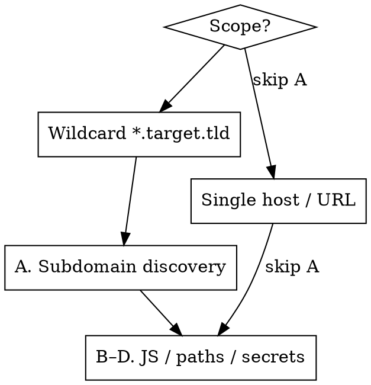

# Recon — JS, Secrets, Paths & Subdomains

Map the attack surface, then hand concrete endpoints/hosts/secrets to the vuln skills and
`curl`. Recon's job is **discovery**, not exploitation. Stay passive-first; never actively
fuzz an out-of-scope host. Drive any HTTP through `curl --proxy http://127.0.0.1:8080` (Burp)
and **save every fetched JS file** — saved files are the system of record.

This skill focuses on four things: **(A) subdomains** (only if scope is a wildcard),
**(B) JS discovery**, **(C) paths/endpoints in JS**, **(D) secrets in JS**.

---

## Scope gate — decide what to run



- **Wildcard `*.target.tld` in scope** → run A (asset discovery) first, then B–D on each live host.
- **One specific host/URL in scope** → **skip A** (no subdomain enum — out of scope), go straight to B–D on that host and the APIs it calls.
- B–D (JS mining) **always** apply. This is where the real bugs hide.

---

## A. Subdomain discovery — wildcard scope only

**Use `/profundis` for this. Do not run subdomain-enumeration tools** (no subfinder, amass,
httpx, etc.). `/profundis` is the single source of asset discovery here.

**REQUIRED SUB-SKILL:** invoke **profundis** for passive discovery (CT/certstream, host & DNS
search). Prefer its `hosts`/`dns` queries (1 credit/page, `raw_query` filtering) and **always
estimate-first** before `subdomains` enumeration so you don't drain the wallet. Pivot on CNAMEs
(`dns` search, `type:CNAME`) for subdomain-takeover candidates — but only report a takeover with
the dangling DNS record *actually present* (see CLAUDE.md always-ignore).

Take the in-scope hosts `/profundis` returns, add them to Burp scope, and run B–D per host.

---

## B. JS discovery — find and pull every bundle

Collect JS URLs from passive archives + a live crawl, then fetch and keep them.

```bash
# Passive URL harvest (Wayback / CommonCrawl / OTX), keep only JS
gau --subs target.tld | grep -Ei '\.js(\?|$)' | sort -u > js_urls.txt

# Live crawl of the app (JS-aware) — catches lazy-loaded chunks gau misses
katana -silent -u https://app.target.tld -jc -d 3 | grep -Ei '\.js(\?|$)' >> js_urls.txt

# Extract <script src> from a rendered/known page set
subjs -i hosts_live.txt >> js_urls.txt
sort -u js_urls.txt -o js_urls.txt

# Fetch them all (through Burp), save raw — the saved files are ground truth
mkdir -p js && while read -r u; do
  f="js/$(echo "$u" | sed 's#[^a-zA-Z0-9]#_#g').js"
  curl --proxy http://127.0.0.1:8080 -sk "$u" -o "$f"
done < js_urls.txt
```

**Source maps are gold.** For any `bundle.js`, try `bundle.js.map` (or read the
`//# sourceMappingURL=` trailer) — a `.map` reconstructs original, un-minified source incl.
comments and folder structure:

```bash
curl --proxy http://127.0.0.1:8080 -sk "https://app.target.tld/static/main.js.map" -o main.js.map
jq -r '.sources[]' main.js.map        # original file tree → reveals internal module names
```

---

## C. Paths & endpoints in JS

Pull every route, API path, and parameter out of the saved JS. These drive `curl` testing.

```bash
# Reliable baseline: regex-extract relative paths + absolute URLs from saved JS
grep -aErhoE '"(/[a-zA-Z0-9_./-]+)"' js/ | tr -d '"' | sort -u > paths.txt
grep -aErhoE '(https?:)?//[a-zA-Z0-9._-]+/[a-zA-Z0-9_./-]*' js/ | sort -u >> paths.txt

# Richer: xnLinkFinder also pulls params. NOTE: -sf filters by link *domain*, which
# drops relative paths (most of a JS bundle). Add -sp (scope-prefix) + -spo so relative
# /api/... links are prefixed with the scope domain and kept in the output.
xnLinkFinder -i js/ -sp target.tld -spo -sf target.tld -o endpoints.txt
```

What to look for in the output:
- **Hidden/admin/internal routes** — `/api/internal/*`, `/api/admin/*`, `/debug`, `/actuator`.
- **Version pivots** — if the app calls `/api/v3/*`, manually try `/api/v1/*`, `/api/v2/*`
  (older versions often skip newer authz checks).
- **GraphQL** — a `/graphql` reference → try introspection (`{"query":"{__schema{types{name}}}"}`).
- **Swagger/OpenAPI** — pull `/swagger`, `/openapi.json`, `/v3/api-docs` if referenced.
- **Feature flags, role/permission strings, cloud bucket names, third-party integrations.**

Feed discovered paths back to `curl` (and `/idor`, `/ssrf`, `/sql`, …) for actual testing.

---

## D. Secrets in JS

Hardcoded API keys, cloud tokens, JWTs and private keys in bundles are **always worth reporting**
(per CLAUDE.md) and frequently chain to critical (key → backend API → mass data).

Run all four engines — they catch different things. Dedicated scanners (typed detectors,
live verification) first, then the regex catch-all for what their rulesets miss (internal
bucket names, custom token formats).

```bash
# 1. trufflehog — typed detectors + LIVE verification (highest signal). Drop --only-verified
#    to also see unverified hits worth manual review.
trufflehog filesystem js/ --results=verified,unknown --no-update > th.txt
trufflehog filesystem js/ --only-verified --no-update > th_verified.txt   # confirmed-live = report now

# 2. gitleaks — second ruleset engine over the saved files
gitleaks detect --no-git -s js/ -r gitleaks.json

# 3. mantra — fetches each JS URL live and greps for keys (feed it the URL list from B)
cat js_urls.txt | mantra -d > mantra.txt

# 4. Curated regex catch-all shipped with this skill (-i: catches apiKey/APIKEY too).
#    Gets internal S3/GCS bucket names + generic assignments the scanners skip.
grep -aErni -f .claude/skills/recon/secret-patterns.txt js/ > grep_hits.txt
# (in a workspace the skill is symlinked at .claude/skills/recon/; adjust the path if run elsewhere)
```

A `--only-verified` trufflehog hit is a **live** key → report it. Unverified/grep hits are leads
to confirm manually before use.

**Triage — a hit is a lead, not a finding:**
- **Confirm it's live & in-scope** before using it. Don't burn a key on noise.
- **Map the key to its service** — what API does it unlock? what data?
- **Chain to impact:** API key → authenticated backend call → mass read → critical.
  Cloud token → S3/GCS/blob → PII or internal files → critical.
- **One validated secret = stop, document, report.** Do not enumerate or exfiltrate at scale
  (mirrors `/credential-leaks` discipline). Capture the minimal proof and halt.

---

## Handoff — recon → exploitation → report

| Recon output | Next |
|---|---|
| New live host (wildcard) | add to Burp scope → B–D on it |
| Endpoint / hidden route / param | `curl` + `/idor`, `/rbac`, `/ssrf`, `/sql`, `/xss`, `/ssti`, `/xxe` |
| Hardcoded API key / cloud token | validate in-scope → chain → `/report-yeswehack` |
| Leaked credential (OathNet) | `/credential-leaks` validation flow → `/report-yeswehack` |
| Subdomain takeover candidate (dangling CNAME) | confirm record present → `/report-yeswehack` |

A leaked secret or a valid leaked credential is **itself reportable** even before you chain it.

---

## Guardrails

- **Passive-first.** CT/leaks/archives before active crawl. Active crawl only on in-scope hosts.
- **Never actively fuzz out-of-scope hosts.** Inspecting an adjacent asset to prove a chain back
  to in-scope impact is fine; launching injection/fuzzing at it is not (see CLAUDE.md).
- **Profundis wallet:** estimate-first on `subdomains`; prefer 1-credit `hosts`/`dns` queries.
- **Rate limits:** stay under ~10 req/s; `katana`'s default crawl concurrency is fine, don't crank it.
- **Don't enumerate or exfiltrate at scale.** Proof, then stop.

---

## Quick reference — full pass

```bash
# A. (wildcard only) subdomains → invoke /profundis (no local tools). Add returned hosts to Burp scope.

# B. JS discovery
gau --subs target.tld | grep -Ei '\.js(\?|$)' | sort -u > js_urls.txt
katana -silent -u https://app.target.tld -jc -d 3 | grep -Ei '\.js(\?|$)' >> js_urls.txt
sort -u js_urls.txt -o js_urls.txt
mkdir -p js && while read -r u; do curl --proxy http://127.0.0.1:8080 -sk "$u" \
  -o "js/$(echo "$u"|sed 's#[^a-zA-Z0-9]#_#g').js"; done < js_urls.txt

# C. paths/endpoints
grep -aErhoE '"(/[a-zA-Z0-9_./-]+)"' js/ | tr -d '"' | sort -u > paths.txt
xnLinkFinder -i js/ -sp target.tld -spo -sf target.tld -o endpoints.txt

# D. secrets — run all four engines
trufflehog filesystem js/ --only-verified --no-update > th_verified.txt   # live keys = report
gitleaks detect --no-git -s js/ -r gitleaks.json
cat js_urls.txt | mantra -d > mantra.txt
grep -aErni -f .claude/skills/recon/secret-patterns.txt js/ > grep_hits.txt

# → hand hosts/endpoints/secrets to curl + the vuln skills
```
